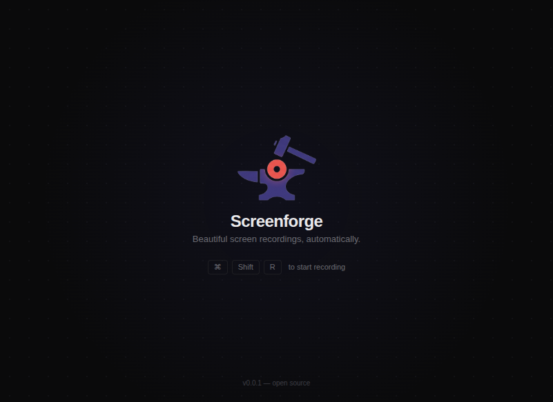

# Screenforge

A free, open-source screen recording tool that automatically zooms and tracks your cursor to create polished screen recordings. No cloud, no subscriptions — everything stays local.

> **Status:** Early development — `v0.0.1` scaffold only, no recording functionality yet.

---

## What it does

Screenforge records your screen while silently tracking your mouse. After recording, it analyzes cursor activity to detect hotspots, generates smooth zoom keyframes, and composites the final video with automatic zoom animations — all processed locally with FFmpeg.

---

## Tech stack

| Layer | Technology |
|---|---|
| App framework | Electron 40 + Electron Forge |
| UI | React 19 + Tailwind CSS v4 |
| Animations | Framer Motion |
| Video processing | FFmpeg (local) |
| Bundler | Vite |
| Language | TypeScript |

---

## Getting started

**Prerequisites:** Node.js 18+, pnpm

```bash
git clone https://github.com/mohibarshi/screenforge.git
cd screenforge
pnpm install
pnpm start
```

### Available commands

```bash
pnpm start      # Start in dev mode (Vite + HMR)
pnpm lint       # Lint TypeScript files
pnpm make       # Build distributable installers
```

---

## Roadmap

- [x] Project scaffold — Electron + React + Vite
- [x] Home / idle screen
- [ ] Screen recording capture
- [ ] Mouse tracking and activity detection
- [ ] Zoom animation logic with easing curves
- [ ] FFmpeg video composition
- [ ] Export flow and UI polish

---

## Contributing

This project uses [Changesets](https://github.com/changesets/changesets) for version management.

```bash
# After making a change
pnpm changeset       # describe your change + pick patch/minor/major
pnpm version         # bump version + update CHANGELOG
pnpm make            # build installers
```

---

## License

MIT © [Mohib Arshi](https://github.com/mohibarshi)
